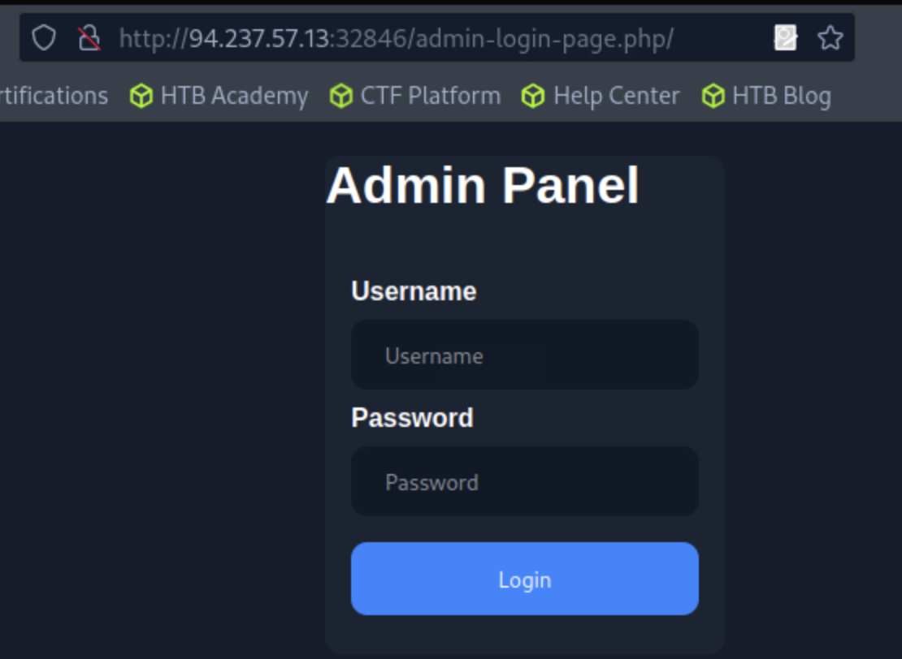
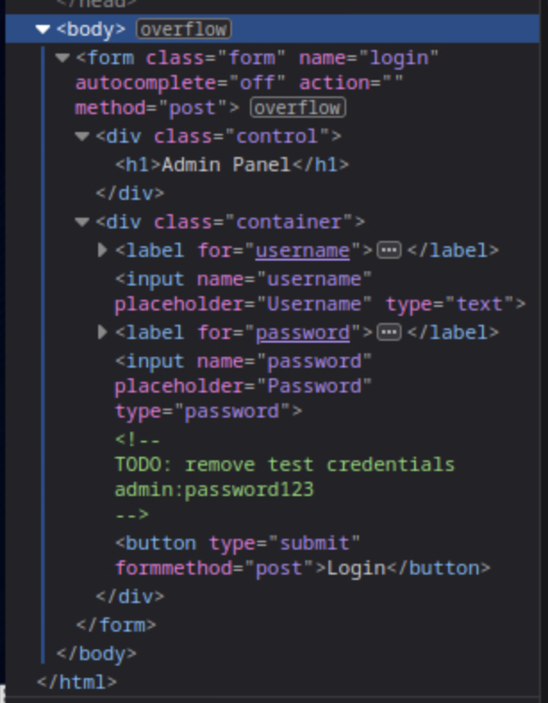
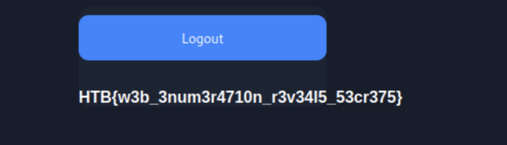

## Web Enumeration Pentest

1. **Server and port**: 94.237.57.13:32846
2. SecLists GitHub [repo](https://github.com/danielmiessler/SecLists) contains several important fuzzing and exploitation scripts.
    ```bash
    TheKamaraju1@htb[/htb]$ git clone https://github.com/danielmiessler/SecLists
    TheKamaraju1@htb[/htb]$ sudo apt install seclists -y
    ```
    - clones and installs the seclists
3. SecLists can be found in ***/usr/share/SecLists/***
    ```bash
    └──╼ [★]$ ls /usr/share/seclists/
    Discovery  IOCs           Passwords         Payloads   Usernames
    Fuzzing    Miscellaneous  Pattern-Matching  README.md  Web-Shells
    ```
4. Directory and file enumeration using gobuster:
    ```bash
    $ gobuster dir -u http://94.237.57.13:32846/ -w /usr/share/seclists/Discovery/Web-Content/common.txt 
    ===============================================================
    Gobuster v3.6
    by OJ Reeves (@TheColonial) & Christian Mehlmauer (@firefart)
    ===============================================================
    [+] Url:                     http://94.237.57.13:32846/
    [+] Method:                  GET
    [+] Threads:                 10
    [+] Wordlist:                /usr/share/seclists/Discovery/Web-Content/common.txt
    [+] Negative Status codes:   404
    [+] User Agent:              gobuster/3.6
    [+] Timeout:                 10s
    ===============================================================
    Starting gobuster in directory enumeration mode
    ===============================================================
    /.hta                 (Status: 403) [Size: 280]
    /.htaccess            (Status: 403) [Size: 280]
    /.htpasswd            (Status: 403) [Size: 280]
    /index.php            (Status: 200) [Size: 990]
    /robots.txt           (Status: 200) [Size: 45]
    /server-status        (Status: 403) [Size: 280]
    /wordpress            (Status: 301) [Size: 325] [--> http://94.237.57.13:32846/wordpress/]
    Progress: 4723 / 4724 (99.98%)
    ===============================================================
    Finished
    ===============================================================
    ```
    - There is success for
        - index.php
        - robots.txt
    - Redirecting for
        - wordpress
5. Open robots.txt
    ```bash
    http://94.237.57.13:32846/robots.txt

    User-agent: *
    Disallow: /admin-login-page.php
    ```
    - Check the admin-login-page.php <br>
    
    - Inspect element in this page to see if there are any comments that we can leverage. <br>
    
    - Use the credentials<br>
    