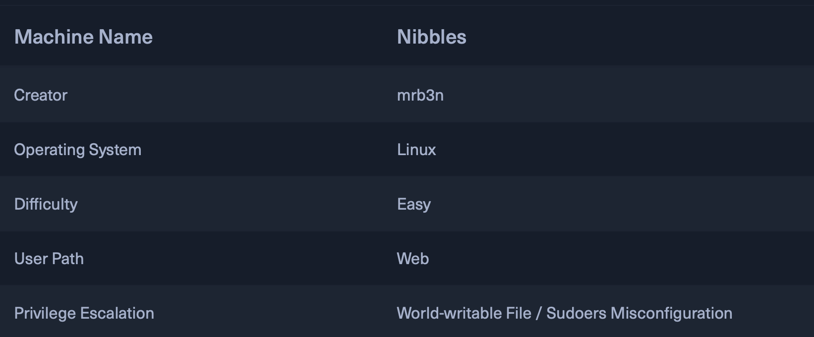

<style>
    img{
        width:350px;
        height:200px;
    }
</style>

## Nibbles walk through
About machine:<br>
**IP:** 10.129.163.241<br>


1. What do you know about the target?
    - Its IP addr
    - That it is a linux box from the image
    - Has a web releated attack vector.
2. This is called `grey box` testing beacuase we have some info about the machine.
    - Other HTB active boxes are all `black box` testing. Only **IP Addr** and **Operating System** is specified.

#### Start with the NMAP Scan
- Start with a service enumeartion and version scan using `-sV`
    - This option runs scan against the default top 1000 ports
- To understand which port Nmap scans for any given scan, **Run a scan with no target specified**
    - Using: `nmap -v -oG -`
        - oG: Greppable format
        - v: Verbose<br>
- Use `-oA` to save the namp output in different formats including
    - XML output, greppable output, and text output
1. Let's start with the service enumeartion and version scan using `-sV`
    ```sh
    $ nmap -sV --open -oA nibbles-initial-scan 10.129.163.241
    Starting Nmap 7.93 ( https://nmap.org ) at 2024-10-08 17:20 EDT
    Nmap scan report for 10.129.163.241
    Host is up (0.054s latency).
    Not shown: 998 closed tcp ports (conn-refused)
    PORT   STATE SERVICE VERSION
    22/tcp open  ssh     OpenSSH 7.2p2 Ubuntu 4ubuntu2.2 (Ubuntu Linux; protocol 2.0)
    80/tcp open  http    Apache httpd 2.4.18 ((Ubuntu))
    Service Info: OS: Linux; CPE: cpe:/o:linux:linux_kernel

    Service detection performed. Please report any incorrect results at https://nmap.org/submit/ .
    Nmap done: 1 IP address (1 host up) scanned in 10.39 seconds
    ```
2. Doing `ls` reveals the following scan outputs in different formats
    ```sh
    $ ls
    academy-regular.ovpn  nibbles-initial-scan.gnmap  nibbles-initial-scan.nmap  nibbles-initial-scan.xml
    ```
- From the nmap output:
    - Ubantu Linux machine
    - 22 SSH OPEN: OpenSSH 7.2p2
    - 80 http OPEN: Apache httpd 2.4.18
3. Run full tcp port scan using `-p-`
    - While this is running in the background, go to step 4
    ```sh
    $ nmap -p- --open -oA nibbles_full_tcp_scan 10.129.163.241
    Starting Nmap 7.93 ( https://nmap.org ) at 2024-10-08 17:28 EDT
    Nmap scan report for 10.129.163.241
    Host is up (0.057s latency).
    Not shown: 63103 closed tcp ports (conn-refused), 2430 filtered tcp ports (no-response)
    Some closed ports may be reported as filtered due to --defeat-rst-ratelimit
    PORT   STATE SERVICE
    22/tcp open  ssh
    80/tcp open  http

    Nmap done: 1 IP address (1 host up) scanned in 32.14 seconds
    ```
    - No additional or new ports found open

4. Use netcat for banner grabbing **SSH**
    ```sh
    $ nc -nv 10.129.163.241 22               
    (UNKNOWN) [10.129.163.241] 22 (ssh) open
    SSH-2.0-OpenSSH_7.2p2 Ubuntu-4ubuntu2.2
    ```
    - An OpenSSH server is running
5. Use netcat to banner grab **http**
    ```sh
    $ nc -nv 10.129.163.241 80
    (UNKNOWN) [10.129.163.241] 80 (http) open
    ```
    - Output shows that an http server is running but no banner shown!

6. Run nmap **script scans** using `-sC` which runs a number or intrusive default scans
    ```sh
    $ nmap -sC -p 20,80 -oA nibbles_script_scan 10.129.163.241
    Starting Nmap 7.93 ( https://nmap.org ) at 2024-10-08 17:36 EDT
    Nmap scan report for 10.129.163.241
    Host is up (0.052s latency).

    PORT   STATE  SERVICE
    20/tcp closed ftp-data
    80/tcp open   http
    |_http-title: Site doesn't have a title (text/html).

    Nmap done: 1 IP address (1 host up) scanned in 2.23 seconds
    ```
    - No new information found here.
7. Finally, lets round nmap scans using **http-enum** script. It is used for enumerating common web application directories
    ```sh
    $ nmap -sV --script=http-enum -oA nibbles_http_enum 10.129.163.241
    Starting Nmap 7.93 ( https://nmap.org ) at 2024-10-08 17:40 EDT
    Nmap scan report for 10.129.163.241
    Host is up (0.055s latency).
    Not shown: 998 closed tcp ports (conn-refused)
    PORT   STATE SERVICE VERSION
    22/tcp open  ssh     OpenSSH 7.2p2 Ubuntu 4ubuntu2.2 (Ubuntu Linux; protocol 2.0)
    80/tcp open  http    Apache httpd 2.4.18 ((Ubuntu))
    |_http-server-header: Apache/2.4.18 (Ubuntu)
    Service Info: OS: Linux; CPE: cpe:/o:linux:linux_kernel

    Service detection performed. Please report any incorrect results at https://nmap.org/submit/ .
    Nmap done: 1 IP address (1 host up) scanned in 16.56 seconds
    ```
    - No new web dirs revealed.
    