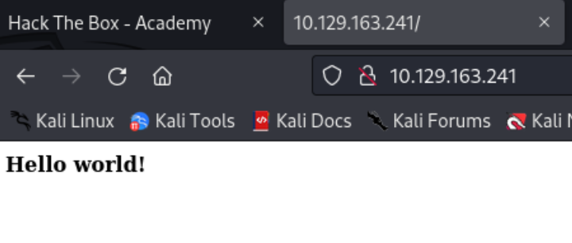
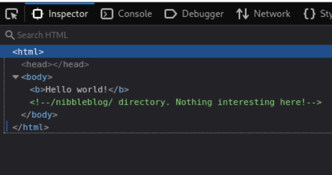
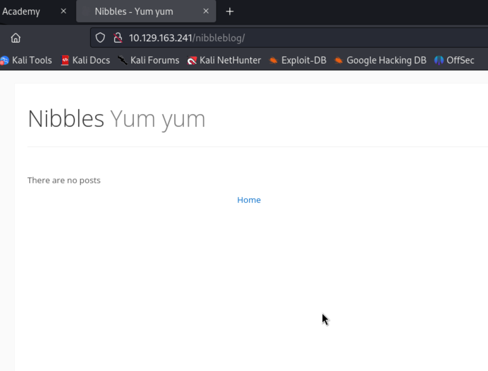
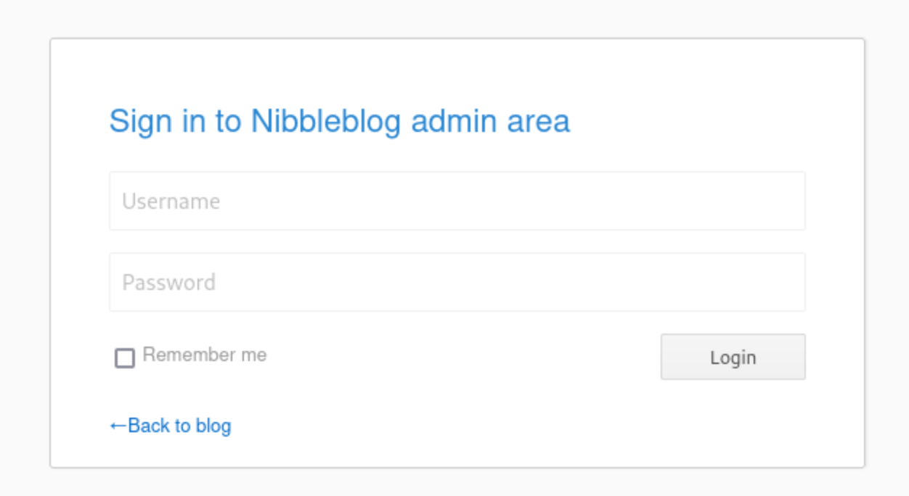
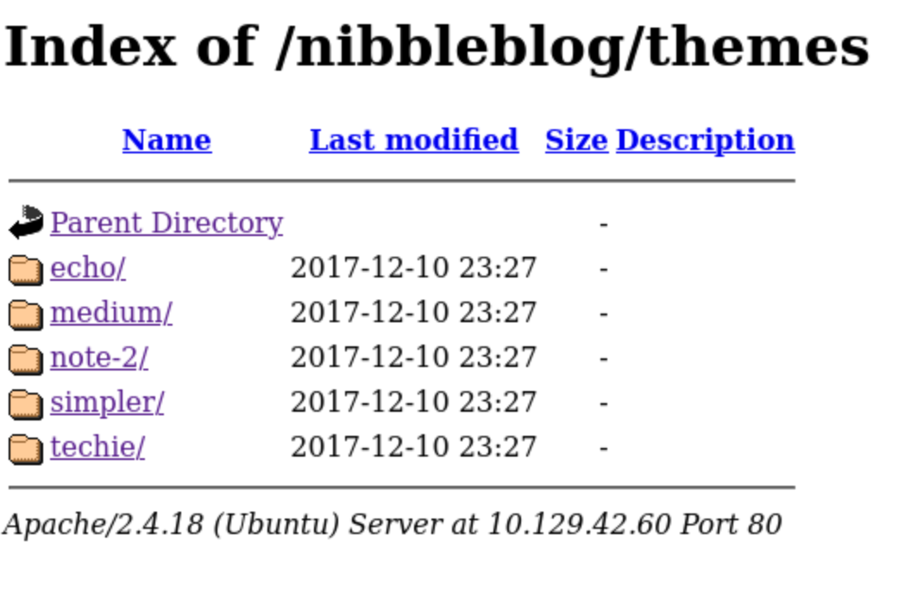
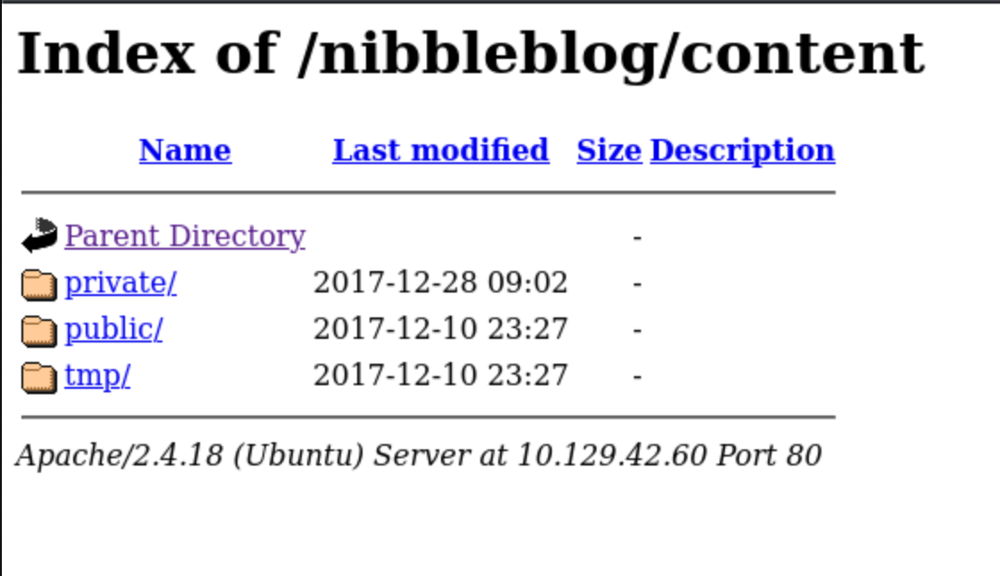
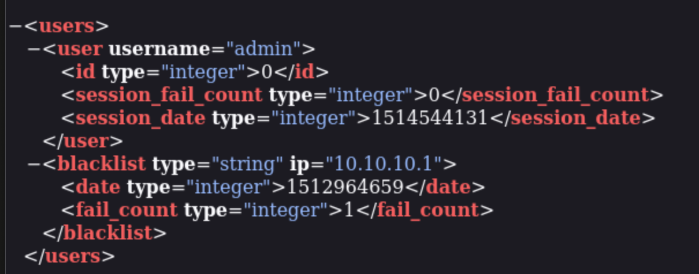

<style>
    img{
        width:350px;
        height:200px;
    }
</style>

## Web Footprinting
- Use `whatweb` to identify the web app in use
```sh
$ whatweb 10.129.163.241
http://10.129.163.241 [200 OK] Apache[2.4.18], Country[RESERVED][ZZ], HTTPServer[Ubuntu Linux][Apache/2.4.18 (Ubuntu)], IP[10.129.163.241]
```
- Didn't identify standard web technologies

1. Surf to the website to see what you can gather:<br>
    
    - Just prints a Hello world message
2. Insptect the page source.<br>
    
    - hints at a `\nibbleblog\` dir
    - Can also inspect using cURL:
    ```sh
    $ curl 10.129.163.241         
    <b>Hello world!</b>

    <!-- /nibbleblog/ directory. Nothing interesting here! -->
    ```
3. Use `whatweb` to enumearte the new dir
    ```sh
    $ whatweb http://10.129.163.241/nibbleblog 
    http://10.129.163.241/nibbleblog [301 Moved Permanently] Apache[2.4.18], Country[RESERVED][ZZ], HTTPServer[Ubuntu Linux][Apache/2.4.18 (Ubuntu)], IP[10.129.163.241], RedirectLocation[http://10.129.163.241/nibbleblog/], Title[301 Moved Permanently]
    http://10.129.163.241/nibbleblog/ [200 OK] Apache[2.4.18], Cookies[PHPSESSID], Country[RESERVED][ZZ], HTML5, HTTPServer[Ubuntu Linux][Apache/2.4.18 (Ubuntu)], IP[10.129.163.241], JQuery, MetaGenerator[Nibbleblog], PoweredBy[Nibbleblog], Script, Title[Nibbles - Yum yum]
    ```
    - Technologies in use such as HTML5, jQuery, and PHP.
4. How to interpret this:
    - The MetaGenerator tag is an HTML tag that provides metadata about the page, like which platform or software was used to generate the webpage.
    - PoweredBy[Nibbleblog] tells you that the backend technology (in this case, Nibbleblog) is responsible for serving that webpage.
    - These are common web frameworks (e.g., WordPress, Nibbleblog, etc.)

5. Visit the webpage:<br>
        
6. Searching for "nibbleblog exploit" on google:    
    - [Nibble blog File Upload Vulnerability](https://www.rapid7.com/db/modules/exploit/multi/http/nibbleblog_file_upload/)
    - It allows an authenticated remote attacker to execute arbitrary PHP code. This module was tested on version 4.0.3
    - But we still `don't know` the version of ***nibbleblog*** the website is using
7. Looking at the source code of this vulnearbility, it seems to be accessing `\admin.php` directory. Use **Gobuster** to check for any other accessible pages/directories.
    ```bash
    $ gobuster dir -u http://10.129.42.60/nibbleblog/ --wordlist /usr/share/seclists/Discovery/Web-Content/common.txt
    ===============================================================
    Gobuster v3.6
    by OJ Reeves (@TheColonial) & Christian Mehlmauer (@firefart)
    ===============================================================
    [+] Url:                     http://10.129.42.60/nibbleblog/
    [+] Method:                  GET
    [+] Threads:                 10
    [+] Wordlist:                /usr/share/seclists/Discovery/Web-Content/common.txt
    [+] Negative Status codes:   404
    [+] User Agent:              gobuster/3.6
    [+] Timeout:                 10s
    ===============================================================
    Starting gobuster in directory enumeration mode
    ===============================================================
    /.htaccess            (Status: 403) [Size: 307]
    /.htpasswd            (Status: 403) [Size: 307]
    /.hta                 (Status: 403) [Size: 302]
    /README               (Status: 200) [Size: 4628]
    /admin                (Status: 301) [Size: 323] [--> http://10.129.42.60/nibbleblog/admin/]
    /admin.php            (Status: 200) [Size: 1401]
    /content              (Status: 301) [Size: 325] [--> http://10.129.42.60/nibbleblog/content/]                                                             
    /index.php            (Status: 200) [Size: 2987]
    /languages            (Status: 301) [Size: 327] [--> http://10.129.42.60/nibbleblog/languages/]                                                           
    /plugins              (Status: 301) [Size: 325] [--> http://10.129.42.60/nibbleblog/plugins/]                                                             
    /themes               (Status: 301) [Size: 324] [--> http://10.129.42.60/nibbleblog/themes/]                                                              
    Progress: 4734 / 4735 (99.98%)
    ===============================================================
    Finished
    ===============================================================
    ```
    - There is a `/admin.php` and `/README` which are 200 and a bunch of 301.
8. Enumerate **/README** further using cURL:
    ```sh
    ─$ curl http://10.129.42.60/nibbleblog/README
    ====== Nibbleblog ======
    Version: v4.0.3
    Codename: Coffee
    Release date: 2014-04-01

    Site: http://www.nibbleblog.com
    Blog: http://blog.nibbleblog.com
    Help & Support: http://forum.nibbleblog.com
    Documentation: http://docs.nibbleblog.com

    ===== Social =====
    * Twitter: http://twitter.com/nibbleblog
    * Facebook: http://www.facebook.com/nibbleblog
    * Google+: http://google.com/+nibbleblog

    ===== System Requirements =====
    * PHP v5.2 or higher
    * PHP module - DOM
    * PHP module - SimpleXML
    * PHP module - GD
    * Directory “content” writable by Apache/PHP
    ```
    - The version of nibbleblog indeed seem to be `4.0.3`. But this could be an old readme file as well.
9. Check the /admin.php portal:
    - 
10. To use the exploit using metasploit we need **Valid** credentials:
    ```sh
    msf6 exploit(multi/http/nibbleblog_file_upload) > show options

    Module options (exploit/multi/http/nibbleblog_file_upload):

    Name       Current Setting  Required  Description
    ----       ---------------  --------  -----------
    PASSWORD                    yes       The password to authenticate with
    Proxies                     no        A proxy chain of format type:host:port[,type:host:port][...]
    RHOSTS                      yes       The target host(s), see https://docs.metasploit.com/docs/using-metasploit/basics/using-metasploit.html
    RPORT      80               yes       The target port (TCP)
    SSL        false            no        Negotiate SSL/TLS for outgoing connections
    TARGETURI  /                yes       The base path to the web application
    USERNAME                    yes       The username to authenticate with
    VHOST                       no        HTTP server virtual host
    ```
    - Both Password and Username are required. We `don't` know either.
11. **/themes** is another directory we can enumerate that had 301 code.
    - 
    - Poke around to see if there is anything interesting (nothing found).
12. **/content** also had 301 code
    - 
    - Poke around to find anything interesting. 
    - Found a users.xml file! <br>
    
    - We can also get this file using `cURL` and prettify the XML output using `xmllint`
    ```bash
    ─$ curl -s http://10.129.42.60/nibbleblog/content/private/users.xml | xmllint  --format -

    <?xml version="1.0" encoding="UTF-8" standalone="yes"?>
    <users>
    <user username="admin">
        <id type="integer">0</id>
        <session_fail_count type="integer">0</session_fail_count>
        <session_date type="integer">1514544131</session_date>
    </user>
    <blacklist type="string" ip="10.10.10.1">
        <date type="integer">1512964659</date>
        <fail_count type="integer">1</fail_count>
    </blacklist>
    </users>
    ```
13. **Username** = `admin` but no password is known yet. So far we have the following info:
    - A Nibbleblog install potentially vulnerable to an authenticated file upload vulnerability.
    - An admin portal at nibbleblog/admin.php
    - Directory listing which confirmed that admin is a valid username
    - Taking another look through all of the exposed directories, we find a `config.xml` file.
    ```sh
    ─$ curl -s http://10.129.42.60/nibbleblog/content/private/config.xml | xmllint  --format -

    <?xml version="1.0" encoding="utf-8" standalone="yes"?>
    <config>
    <name type="string">Nibbles</name>
    <slogan type="string">Yum yum</slogan>
    <footer type="string">Powered by Nibbleblog</footer>
    <advanced_post_options type="integer">0</advanced_post_options>
    <url type="string">http://10.10.10.134/nibbleblog/</url>
    <path type="string">/nibbleblog/</path>
    <items_rss type="integer">4</items_rss>
    <items_page type="integer">6</items_page>
    <language type="string">en_US</language>
    <timezone type="string">UTC</timezone>
    <timestamp_format type="string">%d %B, %Y</timestamp_format>
    <locale type="string">en_US</locale>
    <notification_email_to type="string">admin@nibbles.com</notification_email_to>
    <snip>
    ```
    - there is an email address **admin@nibbles.com**. There also 2 mention of **nibbles**
        - Can `nibbles` be the password?

